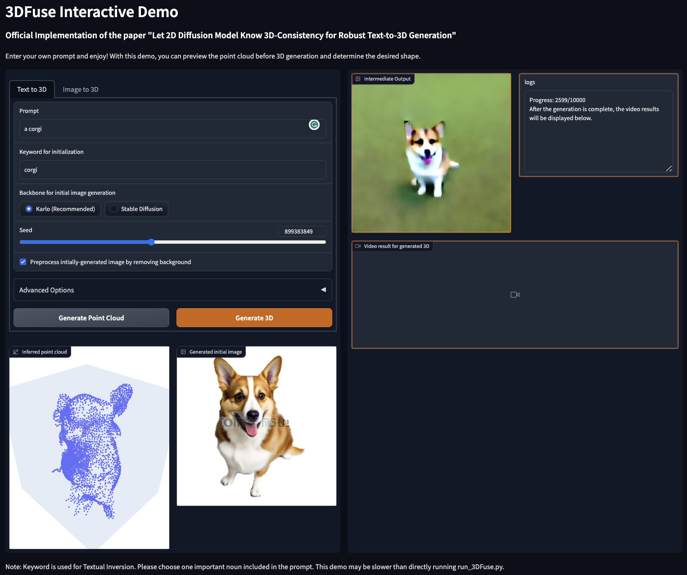
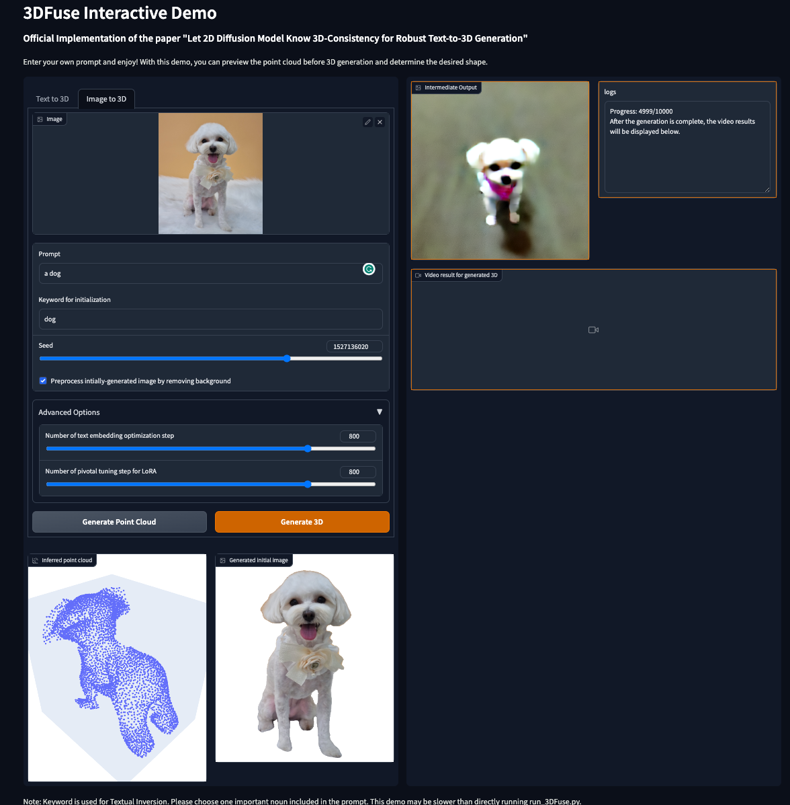

# Let 2D Diffusion Model Know 3D-Consistency for Robust Text-to-3D Generation
<a href="https://arxiv.org/abs/2303.07937"></a>
<a href="https://ku-cvlab.github.io/3DFuse/"></a>
<br>
This is official implementation of the paper "Let 2D Diffusion Model Know 3D-Consistency for Robust Text-to-3D Generation". The last column of each example is our result.

## Introduction

<center>
 
</center>

We introduce 3DFuse, a novel framework that incorporates 3D awareness into pretrained 2D diffusion models, enhancing the robustness and 3D consistency of score distillation-based methods. For more details, please visit our [project page](https://ku-cvlab.github.io/3DFuse/)!

## 🔥TODO
- [x] 3D Generation/Gradio Demo Code
- [ ] Colab Code / HuggingFace🤗 Demo Release
- [ ] Mesh Converting Code

## Installation
Please follow [installation](INSTALL.md).

## Interactive Gradio App
### for Text-to-3D / Image-to-3D
Enter your own prompt and enjoy! With this gradio app, you can preview the point cloud before 3D generation and determine the desired shape.
```
python gradio_app.py
# or python gradio_app.py --share
```
<div style="text-align:center">
    
    
</div>

## Text-to-3D Generation
After modifying the `run.sh` file with the desired prompt and hyperparameters, please execute the following command:
```
sh run.sh
```

## Acknowledgement
We would like to acknowledge the contributions of public projects, including [SJC](https://github.com/pals-ttic/sjc/) and [ControlNet](https://github.com/lllyasviel/ControlNet) whose code has been utilized in this repository.

## Citation
```
@article{seo2023let,
  title={Let 2D Diffusion Model Know 3D-Consistency for Robust Text-to-3D Generation},
  author={Seo, Junyoung and Jang, Wooseok and Kwak, Min-Seop and Ko, Jaehoon and Kim, Hyeonsu and Kim, Junho and Kim, Jin-Hwa and Lee, Jiyoung and Kim, Seungryong},
  journal={arXiv preprint arXiv:2303.07937},
  year={2023}
}
```
